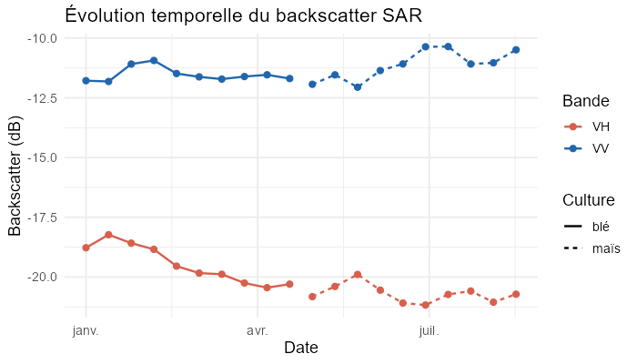
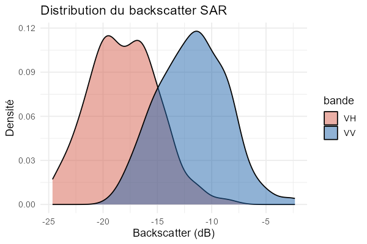
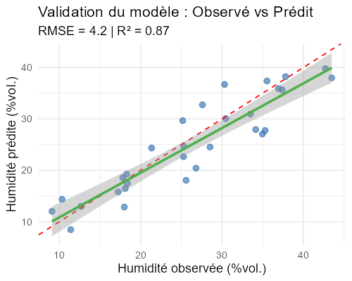
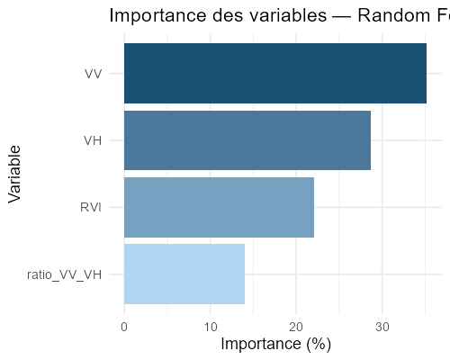

# agroSAR

[]()
[]()

> Package R pour le suivi agricole par télédétection radar Sentinel-1

---

## Installation

```r
devtools::install_github("ayaelhendaoui-blip/agroSAR")
```

---

## Fonctions principales

| Fonction | Description |
|----------|-------------|
| `download_sentinel1()` | Télécharge les images Sentinel-1 via STAC |
| `import_sar_data()` | Importe et recadre les rasters VV/VH |
| `convert_to_db()` | Convertit en décibels |
| `clean_sar_data()` | Filtre le bruit speckle |
| `calculate_sar_indices()` | Calcule RVI et ratio VV/VH |
| `get_soilgrids_point()` | Récupère humidité sol depuis SoilGrids |
| `estimate_soil_moisture()` | Modèle ML d'estimation humidité |
| `classify_crop_stage()` | Classification des stades culturaux |
| `plot_sar_map()` | Carte radar agricole |
| `plot_sar_timeseries()` | Série temporelle SAR interactive |

---

## Visualisations

### Évolution temporelle du signal SAR



### Distribution du backscatter VV et VH



### Validation du modèle d'humidité du sol



### Importance des variables — Random Forest



---

## Utilisation rapide

```r
library(agroSAR)

# 1. Télécharger Sentinel-1
fichiers <- download_sentinel1(
  bbox       = c(-5.5, 33.5, -5.0, 34.0),
  date_start = "2024-03-01",
  date_end   = "2024-03-31",
  output_dir = "data-raw/"
)

# 2. Importer + prétraiter
sar     <- import_sar_data(fichiers["VV"], fichiers["VH"])
sar_db  <- convert_to_db(clean_sar_data(sar))
indices <- calculate_sar_indices(sar_db)

# 3. Humidité du sol SoilGrids
sol <- get_soilgrids_point(lon = -5.2, lat = 33.7)

# 4. Modèle ML
modele <- estimate_soil_moisture(features, terrain, method = "rf")
eval   <- evaluate_model(modele, test_data, type = "regression")

# 5. Visualisations
plot_sar_timeseries(ts_data, interactive = TRUE)
plot_sar_map(sar_db, band = "VV_dB")
plot_soil_moisture_map(raster_humidite, parcelles)
```

---

## Structure du package

## Données utilisées

| Source | Données | Accès |
|--------|---------|-------|
| Copernicus / STAC | Sentinel-1 GRD VV/VH | Gratuit |
| ISRIC SoilGrids | Humidité sol 0–5 cm | Gratuit |

## Auteur

**Aya El Hendaoui**  
Package développé dans le cadre d'un projet de télédétection agricole.
